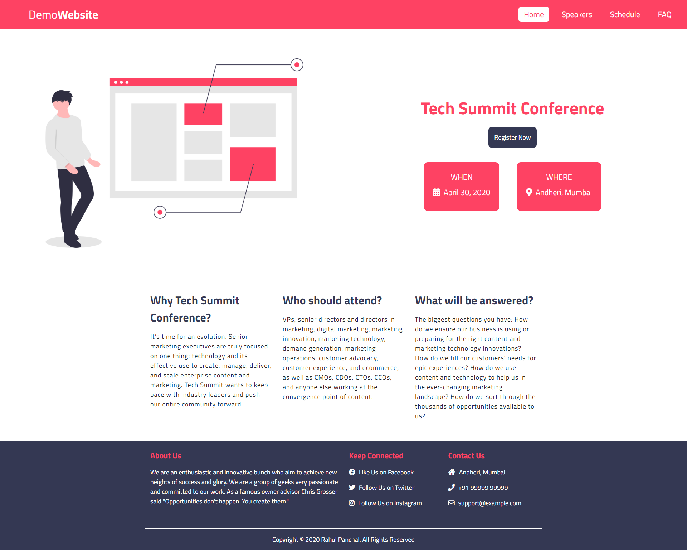
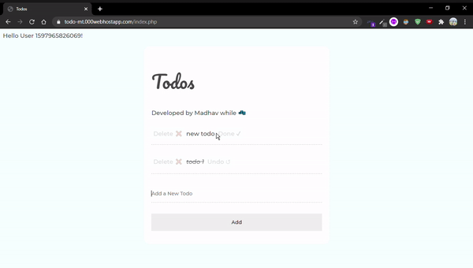

<h1 align="center">Awesome-Web-Art</h1>

  

 
  

  

A place to showcase your creativity in Web.

This repo contains a curated list of awesome work done using some web-weapons like HTML, CSS and JavaScript.

Before start contributing please read the [CONTRIBUTING.md](https://github.com/clubgamma/Awesome-Web-Art/blob/master/CONTRIBUTING.md) first.

# Tools to make your work easier

- Video to GIF converter
  - [ezgif](https://ezgif.com/video-to-gif)
  - [zamzar](https://www.zamzar.com/convert/mp4-to-gif/)
  - [online-convert](https://image.online-convert.com/convert/mp4-to-gif)

# Art Work

| Art💖 | Code📃 | Artist😎 |
|---|---|---|
|  | [Find the code here](https://github.com/clubgamma/Awesome-Web-Art/tree/master/yashpaneliya) | [Yash Paneliya](https://github.com/yashpaneliya) |
|  | [Find the code here](https://github.com/darshvaghasia12/Awesome-Web-Art/blob/master/darshvaghasia12/FrameAnimation.html) | [Darsh Vaghasia](https://github.com/darshvaghasia12) |
|  | [Find the code here](https://github.com/darshvaghasia12/Awesome-Web-Art/blob/master/darshvaghasia12/Cascading%20Solar%20System%20Animation.html) | [Darsh Vaghasia](https://github.com/darshvaghasia12) |
|  | [Find the code here](https://github.com/darshvaghasia12/Awesome-Web-Art/blob/master/darshvaghasia12/Dragon-Loading-Animation) | [Darsh Vaghasia](https://github.com/darshvaghasia12) |
|  | [Find the code here](https://github.com/darshvaghasia12/Awesome-Web-Art/blob/master/darshvaghasia12/index2.html) | [Darsh Vaghasia](https://github.com/darshvaghasia12) |
|  | [Find the code here](https://github.com/krish-pabani/Awesome-Web-Art/blob/master/krish-pabani/animation4.html) | [Krish Pabani](https://github.com/krish-pabani) |
|  | [Find the code here](https://github.com/krish-pabani/Awesome-Web-Art/blob/master/krish-pabani/animation1.html) | [Krish Pabani](https://github.com/krish-pabani) |
|  | [Find the code here](https://github.com/MananJoshimj/Awesome-Web-Art/blob/MananJoshimj-3D-Animation-1/MananJoshimj/3D%20Animation.html) | [Manan Joshi](https://github.com/MananJoshimj) |
|  | [Find the code here](https://github.com/MananJoshimj/Awesome-Web-Art/blob/MananJoshimj-3D-Animation-1/MananJoshimj/Animation3) | [Manan Joshi](https://github.com/MananJoshimj) |
|  | [Find the code here](https://github.com/MananJoshimj/Awesome-Web-Art/blob/MananJoshimj-3D-Animation-1/MananJoshimj/Animation2.html) | [Manan Joshi](https://github.com/MananJoshimj) |
|  | [Find the code here](https://github.com/YashMakadiya123/Awesome-Web-Art/blob/YashMakadiya123-3D_Animation_revolve/YashMakadiya123/3D-Animation_revolve.html) | [Yash Makadiya](https://github.com/YashMakadiya123) |
|  | [Find the code here](https://github.com/AyushSojitra/Awesome-Web-Art/blob/master/AyushSojitra/Share_button.html) | [Ayush Sojitra](https://github.com/AyushSojitra) |
|  | [Find the code here](https://github.com/krish-pabani/Awesome-Web-Art/blob/master/krish-pabani/animation2.html) | [Krish Pabani](https://github.com/krish-pabani) |
|  | [Find the code here](https://github.com/iamrahulpanchal/tech-summit-conference-demo-website) | [Rahul Panchal](https://github.com/iamrahulpanchal) |
|  | [Find the code here](https://github.com/AyushSojitra/Awesome-Web-Art/blob/master/AyushSojitra/second_animation) | [Ayush Sojitra](https://github.com/AyushSojitra) |
|  | [Find the code here](https://github.com/imjp19/Awesome-Web-Art/blob/master/imjp19/index.html) | [Jay Patel](https://github.com/imjp19) |
|  | [Find the code here](https://github.com/YashMakadiya123/Awesome-Web-Art/blob/YashMakadiya123-3D_Animation_cube/YashMakadiya123/3D-Animation_cube.html) | [Yash Makadiya](https://github.com/YashMakadiya123) |
|  | [Find the code here](https://github.com/YashMakadiya123/Awesome-Web-Art/blob/YashMakadiya123-3D-Animation_cubeslider/YashMakadiya123/3D-Animation_cubeslider.html) | [Yash Makadiya](https://github.com/YashMakadiya123) |
|  | [Find the code here](https://github.com/AyushSojitra/Awesome-Web-Art/blob/master/AyushSojitra/search_button_animated.html) | [Ayush Sojitra](https://github.com/AyushSojitra) |
|  | [Find the code here](https://github.com/imjp19/Awesome-Web-Art/blob/master/imjp19/login-signup-animation.html) | [Jay Patel](https://github.com/imjp19) |
|  | [Find the code here](https://github.com/upasanadeka/Awesome-Web-Art/blob/master/upasanadeka/index.html) | [Upasana Deka](https://github.com/upasanadeka) |
|  | [Find the code here](https://github.com/smit4297/Awesome-Web-Art/blob/master/smit4297/index.html) | [Smit Patel](https://github.com/smit4297) |
|  | [Find the code here](https://github.com/imjp19/Awesome-Web-Art/blob/master/imjp19/button-hover.html) | [Jay Patel](https://github.com/imjp19) |
|  | [Find the code here](https://github.com/imjp19/Awesome-Web-Art/blob/master/imjp19/color-change-clock.html) | [Jay Patel](https://github.com/imjp19) |
|  | [Find the code here](https://github.com/sanketchaudhari10/Awesome-Web-Art/blob/master/sanketchaudhari10/animationpage.html) | [Sanket Chaudhari](https://github.com/sanketchaudhari10) |
|  | [Find the code here](https://github.com/imjp19/Awesome-Web-Art/blob/master/imjp19/button-hover.html.html) | [Jay Patel](https://github.com/imjp19) |
|  | [Find the code here](https://github.com/MananJoshimj/Awesome-Web-Art/blob/master/MananJoshimj/Animation3.html) | [Manan Joshi](https://github.com/MananJoshimj) |
|  | [Find the code here](https://github.com/jerry2501/Awesome-Web-Art/blob/master/jerry2501/index.html) | [Jignesh Kukadiya](https://github.com/jerry2501) |
|  | [Find the code here](https://github.com/thevrajshah/Awesome-Web-Art/blob/master/thevrajshah/Accordian.html) | [Vraj Shah](https://github.com/thevrajshah) |
|  | [Find the code here](https://github.com/thevrajshah/Awesome-Web-Art/blob/master/thevrajshah/Glitch.html) | [Vraj Shah](https://github.com/thevrajshah)|
|  | [Find the code here](https://github.com/thevrajshah/Awesome-Web-Art/blob/master/thevrajshah/Name.html) | [Vraj Shah](https://github.com/thevrajshah)  |
|  | [Find the code here](https://github.com/thevrajshah/Awesome-Web-Art/blob/master/thevrajshah/VeggieBurger.html) | [Vraj Shah](https://github.com/thevrajshah) |
|  | [Find the code here](https://github.com/thevrajshah/Awesome-Web-Art/blob/master/thevrajshah/Mustache.html) | [Vraj Shah](https://github.com/thevrajshah) |
|  | [Find the code here](https://github.com/SmitShah090/Awesome-Web-Art/tree/master/SmitShah090/Music%20Player) | [Smit Shah](https://github.com/SmitShah090) |
|  | [Find the code here](https://github.com/kashyap-shah/Awesome-Web-Art/blob/master/kashyap-shah/loading-animation/animation.html) | [Kashyap Shah](https://github.com/kashyap-shah) |
|  | [Find the code here](https://github.com/SmitShah090/Awesome-Web-Art/blob/master/SmitShah090/Music%20Player/Edu_Hub) | [Smit Shah](https://github.com/SmitShah090) |
|  | [Find the code here](https://github.com/SmitShah090/Awesome-Web-Art/blob/master/SmitShah090/Music%20Player/Foodista) | [Smit Shah](https://github.com/SmitShah090) |
|  | [Find the code here](https://github.com/JayMandaviya/Awesome-Web-Art/blob/master/JayMandaviya/button.html) | [Jay Mandaviya](https://github.com/JayMandaviya) |
|  | [Find the code here](https://github.com/JayMandaviya/Awesome-Web-Art/blob/master/JayMandaviya/cloth.html) | [Jay Mandaviya](https://github.com/JayMandaviya) |
|  | [Find the code here](https://github.com/JayMandaviya/Awesome-Web-Art/blob/master/JayMandaviya/Name.html) | [Jay Mandaviya](https://github.com/JayMandaviya) |
|  | [Find the code here](https://github.com/kashyap-shah/Awesome-Web-Art/tree/master/kashyap-shah/Snake%20Game%20-%20JavaScript) | [Kashyap Shah](https://github.com/kashyap-shah) |
|  | [Find the code here](https://github.com/HetGalia/Awesome-Web-Art/tree/master/HetGalia/Pendulum) | [HetGalia](https://github.com/HetGalia) |
|  | [Find the code here](https://github.com/kashyap-shah/Awesome-Web-Art/tree/master/kashyap-shah/Weather%20App%20-%20Javascript%20%26%20API) | [Kashyap Shah](https://github.com/kashyap-shah) |
|  | [Find the code here](https://github.com/HetGalia/Awesome-Web-Art/tree/master/HetGalia/tic-tac-toe) | [HetGalia](https://github.com/HetGalia) |
|  | [Find the code here](https://github.com/omdhimar28/Awesome-Web-Art/blob/master/omdhimar28/Block.html) | [Om Dhimar](https://github.com/omdhimar28) |
|  | [Find the code here](https://github.com/omdhimar28/Awesome-Web-Art/blob/master/omdhimar28/Box.html) | [Om Dhimar](https://github.com/omdhimar28) |
|  | [Find the code here](https://github.com/omdhimar28/Awesome-Web-Art/blob/master/omdhimar28/Ladder.html) | [Om Dhimar](https://github.com/omdhimar28) |
|  | [Find the code here](https://github.com/HetGalia/Awesome-Web-Art/tree/master/HetGalia/Trail) | [HetGalia](https://github.com/HetGalia) |
|  | [Find the code here](madhavtripathi05/todo-mt) | [Madhav Tripathi](https://github.com/madhavtripathi)     |
|  | [Find the code here](https://github.com/YASH4801/Awesome-Web-Art/blob/master/YASH4801/animo.html) | [Yash Narang](https://github.com/YASH4801) |
|  | [Find the code here](https://github.com/anjali-patel21/Awesome-Web-Art/blob/master/anjali-patel21/glowing.html) | [Anjali Patel](https://github.com/anjali-patel21) |
|  | [Find the code here](https://github.com/anjali-patel21/Awesome-Web-Art/blob/master/anjali-patel21/Hello_animation.html) | [Anjali Patel](https://github.com/anjali-patel21) |
|  | [Find the code here](https://github.com/anjali-patel21/Awesome-Web-Art/blob/master/anjali-patel21/loading_animation.html) | [Anjali Patel](https://github.com/anjali-patel21) |
|  | [Find the code here](https://github.com/iamdhrutipatel/Awesome-Web-Art/blob/master/iamdhrutipatel/animation_1.html) | [Dhruti Patel](https://github.com/iamdhrutipatel) |
|  | [Find the code here](https://github.com/iamdhrutipatel/Awesome-Web-Art/blob/master/iamdhrutipatel/animation_2.html) | [Dhruti Patel](https://github.com/iamdhrutipatel) |

# Things to keep in mind

- **Before creating any Pull Request, please register yourself at [Hacktoberfest's Official Website](https://hacktoberfest.digitalocean.com/)**
- **Club Gamma swags will only be shipped inside India**
- **If a maintainer reports behavior that’s not in line with the project’s code of conduct, then you will be ineligible to participate.**
- **Only first 30 contributors who successfully submit minimum 3 PRs to any of the projects in Club Gamma organization will get Club Gamma swags**
- **To get Digital Ocean swags, you just have to make minimum 4 PRs to any open source projects on GitHub**
- **If a maintainer reports your pull request as spam, it will not be counted towards your participation in Hacktoberfest.**

## Contact Us

**To know more about us, visit [official website](https://clubgamma.github.io/) of Club Gamma.**

**To know more about how Club Gamma is going to celebrate Hacktoberfest, click [here](https://clubgamma.github.io/hacktoberfest/)**

 

  
<i>If you want to add any feature or if you found a bug, feel free to open an issue</i>  

 
 
 

